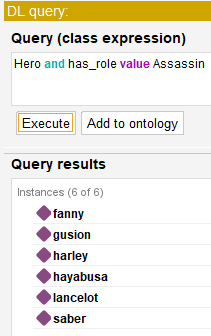
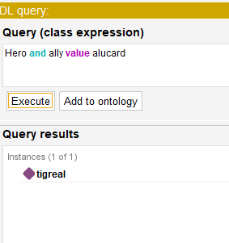

# Отчет по модулю №1 курса 'Системы искусственного интеллекта'

`Толстых Мария Алексеевна`
Группа: `P3330`
ИСУ: `348091`

- Выбранная предметная область: `мобильная игра Mobile Lebends Bang Bang`

---

## Описание целей проекта и его значимости

Данный проект разделяется на две основные цели:

- Разработать базу знаний на языке Prolog, представляющую информацию о выбранной предметной области, в моем случае игра — Mobile Legends: Bang Bang. А также перевести базу знаний на Prolog в онтологическую форму в Protege.
- Создать систему поддержки принятия решений (рекомендательная система), которая будет использовать введенные пользователем данные, чтобы выполнить логические запросы к  БЗ/Онтологии, и предоставлять рекомендации.

Значимость проекта заключается во введении в основы логических языков программирования, в частности Prolog, и в основах создания систем искусственного интеллекта.

--- 

## Анализ требований

Требования к системе принятия решений:

1) Система должна позволить пользователю выбирать интересующие его роли персонажей в игре (например, "маг", "танк", "стрелок"), фракции (например, "эльф", "орк"), союзников и врагов
2) Система должна на основе проведенного с пользователем диалога предоставить ему список рекомендуемых героев или рекомендации по изменению состава команды героев
3) Система должна предоставить пользователю завершить работу программы ответом пользователя 'no' на вопрос Do you want to get a recommendation?

Требования к базе знаний и онтологии:

1) Должны быть представлены роли, фракции, союзники и враги героев
2) Должны быть правила для логического вывода и принятия решений (правила для союзников и врагов по ролям).
3) У каждой героя должно быть обязательно:
   - роль
   - фракция

--- 

## Изучение основных концепций и инструментов

- Обзор основных концепций баз знаний и онтологий

Базы знаний (БЗ) и онтологии являются ключевыми инструментами для организации и представления информации. Базы знаний представляют собой системы, которые хранят факты и правила, позволяющие выполнять логический вывод. Онтологии, в свою очередь, помогают формализовать и структурировать знания в конкретной области, определяя объекты, их свойства и отношения между ними.

- Изучение Prolog и его возможностей для разработки систем искусственного интеллекта

Prolog — это высокоуровневый логический язык программирования, который подходит для создания систем искусственного интеллекта. Его уникальная особенность заключается в том, что разработка программ осуществляется с использованием фактов и правил, что позволяет системе автоматически выводить новые знания на основе заданных условий. Prolog применяется в задачах, связанных с обработкой естественного языка, планированием, решением головоломок и других областях, где требуется логическое мышление и вывод.

Изучая Prolog, я узнала о главных его понятиях: факт - по аналогии логический предикат, правило - расширение фактов, которое позволяет нам получать новые знания на основе имеющихся фактов.


- Ознакомление с инструментами и библиотеками, подходящими для работы с базами знаний и онтологиями на Prolog

Для работы с базами знаний и онтологиями на Prolog мной была выбрана библиотека pyswip, которая обеспечивает интеграцию между Prolog и Python. Это позволило использовать возможности логического вывода Prolog в сочетании с гибкостью Python. Кроме того, SWI-Prolog является одной из наиболее распространенных реализаций Prolog, предоставляющей удобный консольный интерфейс и набор встроенных инструментов для работы с базами знаний и онтологиями. 

--- 

## Реализация системы искусственного интеллекта (системы поддержки принятия решений):

- Реализация рекомендательной системы находится в файле main.py, а базы знаний в файле SysAIlab1.pl

Пример работы рекомендательной системы 

```
Welcome to the Mobile Legends Hero Recommendation System!
Tell us a bit about yourself (for example, 'My name is NAME and I need a hero/team'): My name is Maria and I need a hero
Hello, Maria! Let's proceed to get a recommendation for a hero.
Do you want to get a recommendation? Enter: yes/no: yes
Available roles: tank, fighter, marksman, mage, support, assassin
Please enter your preferred roles (comma separated): mage
Great, you chose these roles: mage.
Available factions: orc, yan_valley, shadow, elf, eastern_village, moniyan, magic_academy, alien_invasion, empire, northern_veil, celestial, north_valley, wild_west
Please enter your preferred factions (comma separated or press Enter if none): northern_veil
Great, you chose these factions: northern_veil.
Available heroes for allies: alucard, lesley, gord, rafaela, miya, balmond, franco, aurora, lancelot, karrie, granger, harley, saber, clint, zhask, tigreal, chou, fanny, hayabusa, gusion
Please enter your preferred allies (comma separated or press Enter if none):
Apparently allies don't matter to you.
Available heroes for enemies: alucard, lesley, gord, rafaela, miya, balmond, franco, aurora, lancelot, karrie, granger, harley, saber, clint, zhask, tigreal, chou, fanny, hayabusa, gusion
Please enter your preferred enemies (comma separated or press Enter if none): zhask
Great, you chose these enemies: zhask.
Recommended heroes: aurora
Were you satisfied with the recommendations? (yes/no): yes
The system is glad to help you! Looking forward to assisting you again. Goodbye!
```

--- 

## Оценка и интерпретация результатов

Примеры запросов к базе знаний в Prolog:

```
?- has_role(X, assassin).
X = lancelot ;
X = harley ;
X = saber ;
X = fanny ;
X = hayabusa ;
X = gusion.

?- is_ally(X, Y), has_role(X, RoleX), has_role(Y, RoleY), RoleX \= RoleY.
X = alucard,
Y = tigreal,
RoleX = fighter,
RoleY = tank ;
X = miya,
Y = rafaela,
RoleX = marksman,
RoleY = support ;
X = tigreal,
Y = alucard,
RoleX = tank,
RoleY = fighter ;
X = rafaela,
Y = miya,
RoleX = support,
RoleY = marksman.

?- is_ally(alucard, Y).
Y = tigreal ;
false.

```

Пример запросов к онтологии в Protege:





Реализованная система соответствует всем пунктам требований.

---

## Заключение

Prolog как логический язык программирования продемонстрировал свои сильные стороны в задачах построения систем поддержки принятия решений. Рекомендательная система эффективно использует базу знаний и позволяет пользователям находить подходящих героев на основе их предпочтений, а также получать рекомендации по составу команды героев. Разработанная система может быть расширена для более сложных задач, таких как интеграция с большими базами данных или расширение логики рекомендаций.
